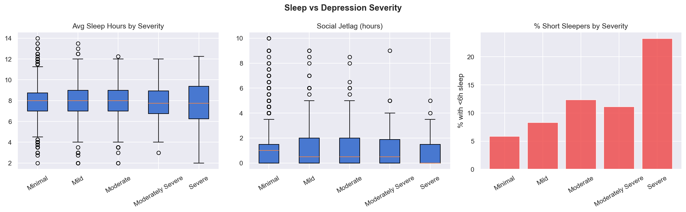
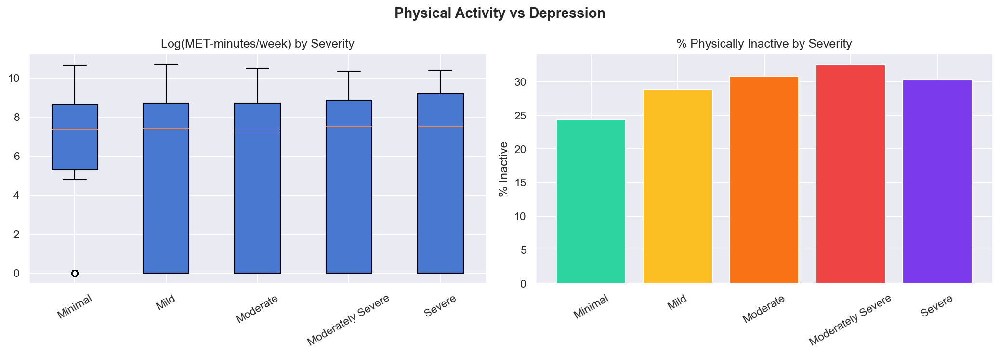
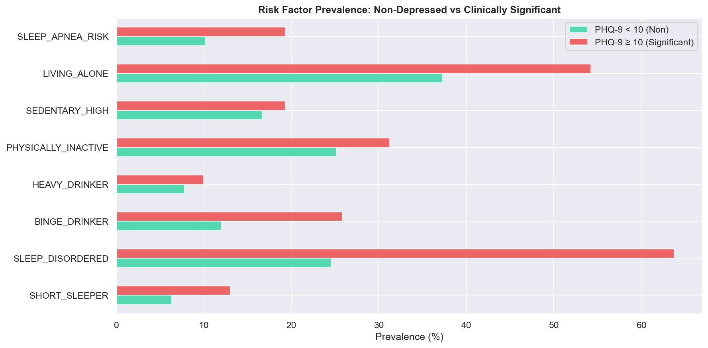

# DepreScan - Sistem Deteksi Risiko Depresi Berbasis Data NHANES

**Coding Camp 2026 powered by DBS Foundation · Tim CC26-PSU066 · Tema: Healthy Lives & Well-being**

> **Disclaimer:** Hasil DepreScan adalah indikasi awal, bukan diagnosis klinis. Jika kamu membutuhkan bantuan segera, hubungi 119 ext. 8 (Kemenkes RI) atau Into The Light Indonesia di 021-7884-5555.

---

## Daftar Isi

- [Gambaran Proyek](#gambaran-proyek)
- [Checklist Data Scientist](#checklist-data-scientist)
- [Struktur Repositori](#struktur-repositori)
- [Dataset](#dataset)
- [Cara Menjalankan Pipeline](#cara-menjalankan-pipeline)
- [Workflow Teknis Pipeline](#workflow-teknis-pipeline)
  - [1. Gather](#1-gather)
  - [2. Assess](#2-assess)
  - [3. Clean](#3-clean)
  - [4. Merge](#4-merge)
  - [5. Target Engineering](#5-target-engineering)
  - [6. Feature Engineering](#6-feature-engineering)
  - [7. EDA](#7-eda)
  - [8. A/B Testing](#8-ab-testing)
  - [9. Save](#9-save)
- [Visualisasi Output Pipeline](#visualisasi-output-pipeline)
- [Hasil Pipeline](#hasil-pipeline)
- [Cara Menjalankan Dashboard](#cara-menjalankan-dashboard)
- [Arsitektur Kode Dashboard](#arsitektur-kode-dashboard)
  - [1. Konfigurasi Halaman dan State Management](#1-konfigurasi-halaman-dan-state-management)
  - [2. Sistem Tema](#2-sistem-tema)
  - [3. Konstanta dan Mapping](#3-konstanta-dan-mapping)
  - [4. Load Data dan Caching](#4-load-data-dan-caching)
  - [5. Helper Functions](#5-helper-functions)
  - [6. Sidebar dan Filter Global](#6-sidebar-dan-filter-global)
  - [7. Halaman Dashboard](#7-halaman-dashboard)
- [Struktur Halaman Dashboard](#struktur-halaman-dashboard)
- [Pertanyaan Bisnis dan Metode Visualisasi](#pertanyaan-bisnis-dan-metode-visualisasi)
- [Referensi](#referensi)

---

## Gambaran Proyek

DepreScan adalah alat skrining mandiri berbasis web yang mendeteksi risiko depresi secara privat, objektif, dan terjangkau. Proyek ini terdiri dari dua komponen utama yang dikembangkan secara terpisah: pipeline data science dan dashboard analitik interaktif.

Komponen data science membangun pipeline pemrosesan end-to-end dari dataset NHANES 2017-2018 hingga menghasilkan dataset bersih siap pakai untuk tim AI Engineer. Komponen dashboard memvisualisasikan hasil pipeline tersebut secara interaktif, memungkinkan eksplorasi pola kesehatan mental khususnya depresi berdasarkan skor PHQ-9.

Pemisahan antara pipeline (`Utils`) dan dashboard (`Dashboard`) mengikuti prinsip separation of concerns: pipeline dapat dijalankan ulang untuk memperbarui dataset tanpa menyentuh kode visualisasi, dan sebaliknya.

**Mengapa NHANES 2017-2018?**

Siklus ini adalah siklus terakhir yang menggunakan format kuesioner PHQ-9 lengkap (`DPQ010-DPQ090`) sebelum NHANES mengubah metodologinya. Siklus 2019-2020 terdisrupsi pandemi COVID-19 dengan hanya sekitar 4.000 responden sehingga tidak representatif untuk kondisi populasi normal.

| Siklus | PHQ-9 Lengkap | N Sampel | Catatan |
|--------|---------------|----------|---------|
| 2013-2014 | Ya | 10.175 | Tersedia |
| 2015-2016 | Ya | 9.971 | Tersedia |
| **2017-2018** | **Ya** | **9.254** | **Terpilih, Pre-COVID** |
| 2019-2020 | Terbatas | 4.000 | Terdisrupsi COVID |
| 2021-2023 | Format Berbeda | N/A | Metodologi berubah |

**Live Demo:** [deprescan-dashboard.streamlit.app](https://deprescan-dashboard.streamlit.app/)

---

## Checklist Data Scientist

| Quest | Status |
|---|:---:|
| 1. Problem Discovery & Solution Definition | selesai |
| 2. Measurable Business Questions | selesai |
| 3. Data Wrangling (Gathering, Assessing, Cleaning) | selesai |
| 4. Advanced Feature Engineering | selesai |
| 5. Exploratory Data Analysis (EDA) | selesai |
| 6. Statistical Hypothesis Testing (A/B Testing) | selesai |
| 7. Dashboard Deployment | selesai |
| 8. Comprehensive Technical Report | selesai |

Detail lengkap: lihat [CHECKLIST_STATUS.md](./CHECKLIST_STATUS.md)

---

## Struktur Repositori

```
DataScientist/
|
|-- README.md                            # Dokumen ini
|
|-- Utils/                               # Pipeline data science
|   |-- README.md
|   |-- requirements.txt
|   |-- main.py                          # Entry point pipeline
|   |
|   |-- data/
|   |   |-- raw/                         # File XPT mentah NHANES (tidak di-commit)
|   |   |   |-- DEMO_J.xpt
|   |   |   |-- DPQ_J.xpt
|   |   |   |-- ALQ_J.xpt
|   |   |   |-- PAQ_J.xpt
|   |   |   `-- SLQ_J.xpt
|   |   |-- interim/                     # Dataset setelah cleaning
|   |   `-- processed/                   # Dataset siap model
|   |
|   |-- src/
|   |   |-- config/
|   |   |   `-- settings.py              # Path, konstanta, mapping kode NHANES
|   |   |-- utils/
|   |   |   |-- sentinel.py              # Decode SAS XPT sentinel-0
|   |   |   `-- io.py                    # Load XPT, simpan CSV dan PNG
|   |   |-- preproc/
|   |   |   |-- gather.py               # Load semua file XPT
|   |   |   |-- assess.py               # Audit kualitas data
|   |   |   |-- clean.py                # Cleaning per modul
|   |   |   `-- merge.py                # Inner join via SEQN
|   |   |-- features/
|   |   |   |-- target.py               # Bangun PHQ-9 score dan label
|   |   |   |-- demographics.py         # Fitur demografi turunan
|   |   |   |-- alcohol.py              # Fitur domain alkohol
|   |   |   |-- activity.py             # Fitur domain aktivitas (MET)
|   |   |   |-- sleep.py                # Fitur domain tidur
|   |   |   |-- feature_engineering.py  # Fitur interaksi dan komposit
|   |   |   `-- eda.py                  # EDA dan visualisasi
|   |   |-- experiments/
|   |   |   |-- ab_testing.py           # Uji hipotesis Mann-Whitney dan Chi-square
|   |   |   `-- README.md
|   |   `-- pipeline/
|   |       `-- run.py                  # Orkestrasi seluruh pipeline
|   |
|   `-- outputs/
|       |-- plot/                        # Plot EDA (7 PNG)
|       |-- abtest/                      # Plot dan CSV hasil A/B Testing
|       `-- json/                        # Metadata pipeline
|
`-- Dashboard/                           # Dashboard analitik interaktif
    |-- dashboard_nhanes_Final.py        # Entry point dashboard (2.160 baris)
    |-- Final_Data.csv                   # Dataset input (5.088 baris x 78 kolom)
    |-- requirements.txt
    `-- README.md
```

> Catatan: Seluruh logika dashboard diimplementasikan dalam satu file `dashboard_nhanes_Final.py` dengan arsitektur modular berbasis fungsi. Tidak ada file CSS atau JS eksternal karena tema sepenuhnya dikelola via `st.markdown()` dengan CSS injection.

---

## Dataset

Lima file SAS XPT dari NHANES 2017-2018. Unduh dari [CDC NHANES](https://wwwn.cdc.gov/nchs/nhanes/search/datapage.aspx?Component=Questionnaire&CycleBeginYear=2017) dan letakkan di `Utils/data/raw/`:

| File | Baris | Domain | Variabel Kunci |
|------|-------|--------|----------------|
| `DEMO_J.xpt` | 9.254 | Demografi | `RIAGENDR`, `RIDAGEYR`, `RIDRETH3`, `DMDEDUC2`, `INDFMPIR` |
| `DPQ_J.xpt` | 5.533 | PHQ-9 (Target) | `DPQ010`-`DPQ090`, `DPQ100` |
| `SLQ_J.xpt` | 6.161 | Tidur | `SLD012`, `SLD013`, `SLQ030`, `SLQ050`, `SLQ120` |
| `PAQ_J.xpt` | 5.856 | Aktivitas Fisik | `PAQ605`-`PAQ665`, `PAD615`-`PAD680` |
| `ALQ_J.xpt` | 5.533 | Alkohol | `ALQ111`, `ALQ121`, `ALQ130`, `ALQ151` |

> **Catatan teknis kritis:** Format SAS XPT meng-encode integer `0` sebagai nilai floating-point sentinel `5.397605346934028e-79`. Nilai ini harus di-decode sebelum analisis apapun, ditangani oleh `src/utils/sentinel.py`.

Setelah pipeline berjalan, output utama yang digunakan dashboard adalah `Final_Data.csv` (hasil rename dari `nhanes_model_ready.csv`), berisi 5.088 responden dengan 78 variabel.

**Kolom-kolom kunci yang digunakan dashboard:**

| Kolom | Tipe | Keterangan |
|-------|------|------------|
| `PHQ9_SCORE` | int | Skor total PHQ-9 (0-27) |
| `PHQ9_SEVERITY` | str | 5 kategori depresi |
| `PHQ9_BINARY` | int | 1 jika PHQ9_SCORE >= 10 |
| `GENDER` | float | 1=Laki-laki, 2=Perempuan |
| `AGE` | float | Usia dalam tahun |
| `AGE_GROUP` | str | Kelompok usia (18-29, ..., 75+) |
| `EDUCATION` | float | Jenjang pendidikan (1-5) |
| `RACE` | float | Kode ras/etnis NHANES |
| `MARITAL` | float | Status pernikahan (1-6) |
| `LIVING_ALONE` | int | 1 jika tidak memiliki pasangan |
| `PIR` | float | Poverty Income Ratio |
| `AVG_SLEEP_HOURS` | float | Rata-rata jam tidur per malam |
| `SLEEP_RISK_SCORE` | int | Skor risiko tidur (0-4) |
| `SLEEP_DISORDERED` | int | 1 jika diagnosis gangguan tidur |
| `SLEEP_APNEA_RISK` | int | 1 jika risiko sleep apnea |
| `PA_CATEGORY` | str | Active / Insufficiently Active / Inactive |
| `TOTAL_MET_MIN` | float | Total MET menit per minggu |
| `SEDENTARY_HOURS` | float | Jam duduk per hari |
| `ALCOHOL_RISK_SCORE` | int | Skor risiko alkohol (0-3) |
| `BINGE_DRINKER` | int | 1 jika binge drinker |
| `HEAVY_DRINKER` | int | 1 jika heavy drinker |
| `TOTAL_RISK_COMPOSITE` | float | Skor risiko komposit tertimbang |
| `N_SEVERE_ITEMS` | int | Jumlah item PHQ-9 dengan skor >= 2 |
| `DPQ100` | float | Item ke-10 PHQ (pikiran menyakiti diri) |

---

## Cara Menjalankan Pipeline

### 1. Clone repositori

```powershell
git clone https://github.com/DepreScanAI/DataScientist.git
cd DataScientist
cd Utils
```

### 2. Buat Virtual Environment

```powershell
python -m venv deprescan
.\deprescan\Scripts\activate
pip install -r requirements.txt
```

### 3. Letakkan dataset di folder yang benar

```
data/raw/DEMO_J.xpt
data/raw/DPQ_J.xpt
data/raw/ALQ_J.xpt
data/raw/PAQ_J.xpt
data/raw/SLQ_J.xpt
```

Path ini sudah dikonfigurasi di `src/config/settings.py`:

```python
RAW_DATA_DIR = "data/raw/"
OUTPUT_DIR   = "outputs"
O_DATASET    = ["data/interim", "data/processed"]
O_PLOT       = "outputs/plot"
O_JSON       = "outputs/json"
O_ABTEST     = "outputs/abtest"
```

### 4. Jalankan pipeline

```powershell
python main.py
```

Atau dari modul pipeline langsung:

```powershell
python -m src.pipeline.run
```

### 5. Skip EDA atau A/B Testing (opsional)

```python
run_full_pipeline(run_eda_flag=False, run_ab_flag=False)
```

---

## Workflow Teknis Pipeline

Pipeline berjalan secara berurutan melalui 9 tahap yang diorkestrasikan oleh `src/pipeline/run.py`:

```
+---------------------------------------------------------------+
|  1. GATHER    -> Load 5 file XPT dari data/raw/               |
|  2. ASSESS    -> Audit kualitas: sentinel, missing, outlier   |
|  3. CLEAN     -> Decode, imputasi, skip-logic per modul       |
|  4. MERGE     -> Inner join via SEQN -> 5.088 baris           |
|  5. TARGET    -> PHQ9_SCORE, SEVERITY, LABEL, BINARY          |
|  6. FEATURES  -> 73 fitur dari 4 domain gaya hidup            |
|  7. EDA       -> 7 visualisasi PNG -> outputs/plot/           |
|  8. A/B TEST  -> 8 uji hipotesis -> outputs/abtest/           |
|  9. SAVE      -> data/interim/, data/processed/, outputs/json/|
+---------------------------------------------------------------+
```

---

### 1. Gather

**Modul:** `src/preproc/gather.py`

Memuat kelima file XPT menggunakan `pandas.read_sas(format="xport")`. Tidak ada transformasi pada tahap ini karena setiap DataFrame disimpan persis seperti yang dikembalikan dari file sumber untuk menjaga reproducibility audit data.

```python
from src.preproc.gather import gather_raw_data
raw_dfs = gather_raw_data()
# Output: dict {"DEMO_J": df, "ALQ_J": df, "DPQ_J": df, "PAQ_J": df, "SLQ_J": df}
```

---

### 2. Assess

**Modul:** `src/preproc/assess.py`

Audit kualitas dilakukan per DataFrame dan menghasilkan laporan yang mencakup:

- Deteksi nilai sentinel-0 (`5.397605e-79`) sebelum decode, membedakan "nol nyata" dari NaN
- Missing values setelah decode sentinel dan replace kode Refused/DK
- Duplikat SEQN (ID responden) yang bisa mengindikasikan error join
- Outlier menggunakan metode IQR pada kolom numerik kontinu
- Nilai unik per kolom sebagai sanity check

---

### 3. Clean

**Modul:** `src/preproc/clean.py`

Cleaning dilakukan per modul dengan strategi yang disesuaikan karakteristik masing-masing:

| Modul | Tindakan Utama | Baris Setelah Clean |
|-------|----------------|---------------------|
| `DEMO_J` | Filter usia >=18, decode sentinel RIDAGEYR dan INDFMPIR, replace Refused (77/99) ke NaN, imputasi EDUCATION (median) dan MARITAL (mode) | 5.856 |
| `DPQ_J` | Decode sentinel 9 item PHQ-9, drop baris dengan semua item NaN (440 baris), drop >4 item NaN (5 baris), imputasi parsial dengan median | **5.088** |
| `SLQ_J` | Decode sentinel SLQ030/040/120, clipping SLD012/013 ke [2, 16] jam, imputasi NaN dengan median (8.0 jam) | 6.161 |
| `PAQ_J` | Replace 9999 (Don't Know) ke NaN, skip-logic: PAQ=No maka PAD=0, imputasi PAD680 (median 300 mnt) | 5.856 |
| `ALQ_J` | Decode sentinel ALQ121, skip-logic: ALQ111=2 (never drinker) maka ALQ121=0 dan ALQ130=0, replace 777/999 ke NaN | 5.533 |

> `DPQ_J` adalah bottleneck pipeline karena PHQ-9 hanya diukur pada MEC-subsample.

---

### 4. Merge

**Modul:** `src/preproc/merge.py`

Inner join kelima DataFrame menggunakan `SEQN` (Respondent Sequence Number) sebagai primary key. Urutan merge: `DPQ` (base) -> `DEMO` -> `ALQ` -> `PAQ` -> `SLQ`.

Inner join dipilih untuk memastikan setiap responden memiliki data lengkap dari semua domain. Ini menghasilkan dataset yang paling bersih untuk supervised learning meskipun mengurangi jumlah sampel dari 9.254 menjadi **5.088 baris**.

---

### 5. Target Engineering

**Modul:** `src/features/target.py`

Membangun empat variabel target dari 9 item `DPQ010-DPQ090`:

```
PHQ9_SCORE    = sum(DPQ010 + ... + DPQ090)        -> range 0-27
PHQ9_SEVERITY = Minimal | Mild | Moderate |        -> 5 kategori
                Moderately Severe | Severe
PHQ9_LABEL    = 0 | 1 | 2 | 3 | 4                -> untuk multiclass
PHQ9_BINARY   = 1 jika PHQ9_SCORE >= 10           -> threshold klinis
```

Threshold berdasarkan Kroenke, Spitzer & Williams (2001), dengan sensitivitas 88% dan spesifisitas 88% pada PHQ-9 >= 10 untuk Major Depressive Disorder.

**Distribusi kelas:**

| Kategori | N | % |
|----------|---|---|
| Minimal (0-4) | 3.786 | **74,4%** |
| Mild (5-9) | 841 | 16,5% |
| Moderate (10-14) | 292 | 5,7% |
| Moderately Severe (15-19) | 126 | 2,5% |
| Severe (20-27) | 43 | 0,8% |

> Distribusi sangat tidak seimbang. Tim AI Engineer perlu menerapkan SMOTE atau `class_weight` sebelum training.

---

### 6. Feature Engineering

**Modul:** `src/features/demographics.py`, `alcohol.py`, `activity.py`, `sleep.py`, `feature_engineering.py`

#### Domain Demografi

| Fitur | Formula/Logika |
|-------|----------------|
| `GENDER_F` | 1 jika perempuan (2), else 0 |
| `AGE_GROUP` | Bin usia: 18-29, 30-44, 45-59, 60-74, 75+ |
| `EDUCATION_ORD` | Ordinal 1-5 (cast integer dari EDUCATION) |
| `MARITAL_BINARY` | 1 jika Married atau Living with partner |
| `LIVING_ALONE` | 1 jika Widowed/Divorced/Separated/Never married |
| `PIR_GROUP` | Poor (<1) / Near poor (1-2) / Middle (2-4) / High (>=4) |
| `INCOME_BINARY` | 1 jika PIR < 1.5 |

#### Domain Tidur

| Fitur | Formula/Logika |
|-------|----------------|
| `AVG_SLEEP_HOURS` | (SLD012 + SLD013) / 2 |
| `SLEEP_DEVIATION` | ABS(AVG_SLEEP_HOURS - 8) |
| `SOCIAL_JETLAG` | ABS(SLD013 - SLD012) |
| `SHORT_SLEEPER` | 1 jika AVG_SLEEP_HOURS < 6 |
| `LONG_SLEEPER` | 1 jika AVG_SLEEP_HOURS > 9 |
| `SLEEP_DISORDERED` | 1 jika SLQ050 = 1 |
| `SLEEP_APNEA_RISK` | 1 jika SLQ040 >= 2 |
| `UNRESTED_FREQ` | SLQ120 ordinal 0-4 |
| `SLEEP_RISK_SCORE` | SHORT + LONG + DISORDERED + APNEA + (UNRESTED>=2) |

#### Domain Aktivitas Fisik (MET-minutes/week)

| Fitur | Formula/Logika |
|-------|----------------|
| `VIG_MIN_WEEK` | (PAD615 x 5) + (PAD660 x 3) |
| `MOD_MIN_WEEK` | (PAD630 x 5) + (PAD645 x 5) + (PAD675 x 3) |
| `TOTAL_MET_MIN` | VIG x 8.0 + MOD x 4.0 (koefisien WHO/GPAQ) |
| `LOG_MET` | log(1 + TOTAL_MET_MIN) |
| `SEDENTARY_HOURS` | PAD680 / 60 |
| `SEDENTARY_HIGH` | 1 jika SEDENTARY_HOURS > 8 |
| `MEETS_PA_GUIDELINE` | 1 jika TOTAL_MET_MIN >= 500 |
| `PHYSICALLY_INACTIVE` | 1 jika TOTAL_MET_MIN < 150 |
| `PA_CATEGORY` | Active / Insufficiently Active / Inactive |

#### Domain Alkohol

| Fitur | Formula/Logika |
|-------|----------------|
| `ALCOHOL_EVER` | 1 jika ALQ111 = 1 |
| `ALCOHOL_CURRENT` | 1 jika ALQ121 > 0 |
| `DRINK_FREQ_SCORE` | Invert ALQ121: 0->0, 1->10, 10->1 |
| `AVG_DRINKS_DAY` | = ALQ130 |
| `BINGE_DRINKER` | 1 jika ALQ151 = 1 |
| `HEAVY_DRINKER` | 1 jika AVG_DRINKS_DAY > 4 (NIAAA threshold) |
| `ALCOHOL_RISK_SCORE` | CURRENT + BINGE + HEAVY (0-3) |

#### Fitur Interaksi dan Komposit

| Fitur | Formula | Tujuan |
|-------|---------|--------|
| `SLEEP_X_INACTIVE` | SHORT_SLEEPER x PHYSICALLY_INACTIVE | Efek sinergis kurang tidur dan inaktivitas |
| `ALCOHOL_X_SEDENTARY` | ALCOHOL_RISK_SCORE x SEDENTARY_HIGH | Kombinasi perilaku berisiko |
| `LONELINESS_PROXY` | LIVING_ALONE x (UNRESTED_FREQ >= 2) | Proxy kesepian multi-dimensi |
| `SLEEP_ALCOHOL_SUM` | SLEEP_RISK_SCORE + ALCOHOL_RISK_SCORE | Beban dua faktor mayor |
| `ACTIVE_FEMALE_YOUNG` | GENDER_F x PHYSICALLY_INACTIVE x (AGE <= 44) | Kelompok rentan spesifik |
| `AGE_SLEEP_INTERACT` | AGE x SLEEP_DEVIATION | Efek kumulatif penuaan dan gangguan tidur |
| `PIR_INACTIVE` | (PIR < 1.5) x PHYSICALLY_INACTIVE | Kemiskinan dan inaktivitas |
| `TOTAL_RISK_COMPOSITE` | 2xSLEEP + 1.5xALC + 1xINACTIVE + 0.5xSED | Domain-weighted risk score |

---

### 7. EDA

**Modul:** `src/features/eda.py` -> Output: `outputs/plot/`

Menghasilkan 7 visualisasi yang disimpan sebagai PNG. Lihat bagian [Visualisasi Output Pipeline](#visualisasi-output-pipeline) untuk detailnya.

---

### 8. A/B Testing

**Modul:** `src/experiments/ab_testing.py` -> Output: `outputs/abtest/`

Delapan uji hipotesis menggunakan Mann-Whitney U (non-parametrik, karena PHQ-9 tidak normal) dan Chi-square (untuk proporsi):

| Uji | Metode | p-value | Effect Size | Keputusan |
|-----|--------|---------|-------------|-----------|
| Short vs Normal Sleeper | Mann-Whitney U | < 0.001 | r = 0.159 (Small) | REJECT H0 |
| Inactive vs Active | Mann-Whitney U | < 0.001 | r = 0.066 (Negligible) | REJECT H0 |
| Male vs Female | Mann-Whitney U | < 0.001 | r = 0.156 (Small) | REJECT H0 |
| With Partner vs Alone | Mann-Whitney U | < 0.001 | r = 0.162 (Small) | REJECT H0 |
| **No Disorder vs Sleep Disordered** | Mann-Whitney U | **< 0.001** | **r = 0.442 (Medium)** | **REJECT H0** |
| High vs Low Income (PIR) | Chi-square | < 0.001 | V = 0.090 (Negligible) | REJECT H0 |
| Non-binge vs Binge Drinker | Mann-Whitney U | < 0.001 | r = 0.208 (Small) | REJECT H0 |
| Low vs High Sedentary | Mann-Whitney U | 0.005 | r = 0.059 (Negligible) | REJECT H0 |

> **Temuan utama:** Gangguan tidur yang didiagnosis (`SLEEP_DISORDERED`) adalah faktor risiko tunggal dengan effect size terbesar (Medium, r = 0.442).

---

### 9. Save

**Modul:** `src/pipeline/run.py`

| File Output | Path | Keterangan |
|-------------|------|------------|
| `nhanes_mental_health_clean.csv` | `data/interim/` | Dataset lengkap 5.088 x 96 kolom |
| `nhanes_model_ready.csv` | `data/processed/` | Siap model: 5.088 x 73 fitur + 4 target |
| `pipeline_metadata.json` | `outputs/json/` | Ringkasan kolom, distribusi kelas, binary rate |

---

## Visualisasi Output Pipeline

### Distribusi PHQ-9
Histogram skor dan pie chart distribusi 5 kategori severity. Garis merah adalah ambang klinis (>= 10).


---

### Demografi Sampel
Distribusi gender, usia (18-80), ras/etnis 6 kategori, dan tingkat pendidikan.


---

### Tidur vs Tingkat Depresi
Rata-rata jam tidur, social jetlag, dan persentase short sleeper per kategori severity.



---

### Aktivitas Fisik vs Tingkat Depresi
Log(MET-minutes/week) per severity dan persentase inaktif per kategori.



---

### Heatmap Korelasi
Korelasi Pearson antar 13 variabel kunci dengan PHQ9_SCORE. `N_SEVERE_ITEMS` (r=0.81) dan `SLEEP_RISK_SCORE` (r=0.38) adalah prediktor terkuat.


---

### Profil Item PHQ-9 per Severity
Rata-rata skor 9 item PHQ-9 (0-3) per kategori. Item fatigue (DPQ040) dan gangguan tidur (DPQ030) adalah gejala yang muncul lebih awal.


---

### Prevalensi Faktor Risiko
Perbandingan prevalensi 8 faktor risiko antara kelompok non-klinis (PHQ-9 < 10) dan klinis signifikan (PHQ-9 >= 10). `SLEEP_DISORDERED` menunjukkan selisih terbesar (62,5% vs 24,4%).



---

### A/B Testing - Boxplot Perbandingan
Distribusi PHQ-9 score antar kelompok untuk 6 dari 8 uji hipotesis yang dilakukan.


Hasil lengkap A/B Testing tersimpan di `outputs/abtest/ab_test_results.csv`.

---

## Hasil Pipeline

```
+============================================================+
|  PIPELINE COMPLETE                                         |
+============================================================+
|  Final dataset  : 5.088 rows x 96 columns                  |
|  PHQ-9 Positive : 461 (9.1%)                               |
|  Model features : 73                                       |
|  Output dirs    : data/ - outputs/plot - json - abtest     |
+============================================================+
```

Dataset final (`data/processed/nhanes_model_ready.csv`):
- 5.088 responden dewasa (usia >= 18)
- 73 fitur dari 4 domain gaya hidup
- 4 target variable: `PHQ9_SCORE`, `PHQ9_SEVERITY`, `PHQ9_LABEL`, `PHQ9_BINARY`
- Binary positive rate: 9,06% (PHQ-9 >= 10)

---

## Cara Menjalankan Dashboard

Dashboard membutuhkan `Final_Data.csv` (output pipeline) di direktori yang sama dengan `dashboard_nhanes_Final.py`. Jika belum punya file ini, jalankan pipeline terlebih dahulu lalu salin outputnya:

```bash
cp Utils/data/processed/nhanes_model_ready.csv Dashboard/Final_Data.csv
```

### 1. Masuk ke folder Dashboard

```bash
git clone https://github.com/DepreScanAI/DataScientist.git
cd DataScientist
cd Dashboard
```

### 2. Buat Virtual Environment

```powershell
python -m venv depscan-dash
./depscan-dash/Scripts/activate
```

### 3. Install dependensi

**Prasyarat:** Python >= 3.10

```bash
pip install -r requirements.txt
```

| Library | Versi Direkomendasikan | Digunakan untuk |
|---------|------------------------|-----------------|
| `streamlit` | >= 1.32 | Framework UI, session state, sidebar, tabs, metrics |
| `pandas` | >= 2.0 | Load CSV, groupby, pivot, melt, value_counts |
| `numpy` | >= 1.26 | Normalisasi heatmap, operasi numerik |
| `plotly` | >= 5.18 | Seluruh visualisasi interaktif (px dan go) |

### 4. Pastikan `Final_Data.csv` ada di direktori yang sama

```
Dashboard/
|-- dashboard_nhanes_Final.py
`-- Final_Data.csv    <- wajib ada di sini
```

### 5. Jalankan dashboard

```bash
streamlit run dashboard_nhanes_Final.py
```

Dashboard akan terbuka otomatis di browser pada `http://localhost:8501`.

---

## Arsitektur Kode Dashboard

Seluruh kode berada dalam `dashboard_nhanes_Final.py` (2.160 baris) yang diorganisasi menjadi blok-blok berikut:

```
+---------------------------------------------------------------------+
|  1. PAGE CONFIG & SESSION STATE   (baris 1-22)                      |
|  2. THEME SYSTEM (get_theme)      (baris 25-59)                     |
|  3. CONSTANTS & MAPPINGS          (baris 62-121)                    |
|  4. DATA LOADING (load_data)      (baris 125-138)                   |
|  5. HELPER FUNCTIONS              (baris 142-276)                   |
|  6. SIDEBAR & FILTERS             (baris 278-355)                   |
|  7. PAGE FUNCTIONS                (baris 358-2133)                  |
|     |-- render_top10_heatmap()                                       |
|     |-- page_overview()                                             |
|     |-- page_demography()                                           |
|     |-- page_depression()                                           |
|     |-- page_lifestyle()                                            |
|     `-- page_business()                                             |
|  8. MAIN ENTRYPOINT               (baris 2137-2158)                 |
+---------------------------------------------------------------------+
```

---

### 1. Konfigurasi Halaman dan State Management

```python
st.set_page_config(
    page_title="Dashboard Kesehatan Mental NHANES",
    layout="wide",
    initial_sidebar_state="expanded",
)

if "dark" not in st.session_state:
    st.session_state.dark = True      # default: dark mode aktif
if "page" not in st.session_state:
    st.session_state.page = "overview"
```

Navigasi antar halaman dikendalikan via `st.session_state.page`. Setiap tombol sidebar memanggil `st.rerun()` untuk me-refresh tampilan tanpa reload penuh. Pendekatan ini dipilih karena Streamlit tidak memiliki built-in router.

---

### 2. Sistem Tema

```python
def get_theme() -> dict:
    if st.session_state.dark:
        return {"bg": "#0f1117", "card": "#1a1d27", "accent": "#3b82f6", ...}
    else:
        return {"bg": "#f0f4ff", "card": "#ffffff", "accent": "#3b82f6", ...}
```

`get_theme()` mengembalikan dictionary token warna yang digunakan secara konsisten di seluruh komponen:

| Token | Dark Mode | Light Mode | Digunakan Pada |
|-------|-----------|------------|----------------|
| `bg` | `#0f1117` | `#f0f4ff` | Background halaman utama |
| `card` | `#1a1d27` | `#ffffff` | Latar chart, metric container |
| `card2` | `#22263a` | `#e8eeff` | Badge, hover state |
| `text` | `#e2e8f0` | `#1e293b` | Teks utama |
| `text2` | `#94a3b8` | `#475569` | Teks sekunder, insight box |
| `border` | `#2d3748` | `#dde5ff` | Garis pembatas |
| `accent` | `#3b82f6` | `#3b82f6` | Warna aktif, tombol primer |
| `plot_bg` | `#1a1d27` | `#ffffff` | Background canvas Plotly |
| `paper_bg` | `#1a1d27` | `#f0f4ff` | Background paper Plotly |
| `grid` | `#2d3748` | `#e2e8f0` | Gridline chart |
| `insight_bg` | `#1e2a3a` | `#eff6ff` | Latar kotak insight |
| `insight_border` | `#3b82f6` | `#3b82f6` | Garis kiri kotak insight |

Tema diaplikasikan ke Plotly lewat `plo(th)` dan ke komponen Streamlit lewat `inject_css(th)`. CSS injection dilakukan via `st.markdown(..., unsafe_allow_html=True)` untuk meng-override default Streamlit, mencakup: metric container, button gradient, tab styling, sidebar background, dan font Inter dari Google Fonts.

---

### 3. Konstanta dan Mapping

```python
DEP_ORDER = ["Minimal", "Mild", "Moderate", "Moderately Severe", "Severe"]

DEP_COLORS = {
    "Minimal": "#10b981", "Mild": "#3b82f6", "Moderate": "#f59e0b",
    "Moderately Severe": "#f97316", "Severe": "#ef4444",
}

DEP_LABEL = {"Minimal": "Minimal", "Mild": "Ringan", ..., "Severe": "Berat"}

RACE_MAP   = {1.0: "Mexican American", 3.0: "Non-Hispanic White", ...}
EDU_MAP    = {1.0: "< SMP", 2.0: "SMP-SMA awal", ..., 5.0: "Sarjana ke atas"}
MARITAL_MAP = {1.0: "Menikah", 2.0: "Janda/Duda", ..., 6.0: "Hidup Bersama"}

EXCLUDED_FEATURES = {"PHQ9_SCORE", "SEQN", "PHQ9_LABEL", "PHQ9_BINARY", "PHQ9_SEVERITY"}
```

Semua mapping digunakan konsisten di seluruh halaman untuk memastikan label Bahasa Indonesia tampil seragam tanpa transformasi ad-hoc di masing-masing fungsi chart.

---

### 4. Load Data dan Caching

```python
@st.cache_data
def load_data() -> pd.DataFrame:
    df = pd.read_csv("Final_Data.csv")
    df["gender_label"]  = df["GENDER"].map({1.0: "Laki-laki", 2.0: "Perempuan"})
    df["edu_label"]     = df["EDUCATION"].map(EDU_MAP)
    df["race_label"]    = df["RACE"].map(RACE_MAP)
    df["marital_label"] = df["MARITAL"].map(MARITAL_MAP)
    df["pa_label"]      = df["PA_CATEGORY"].map(PA_LABEL)
    return df
```

`@st.cache_data` memastikan CSV hanya dibaca dari disk sekali. Kolom label teks ditambahkan saat load (bukan per-chart) sehingga tidak ada overhead berulang.

---

### 5. Helper Functions

Empat fungsi utilitas yang dipakai di seluruh halaman:

**`plo(th, title, height)`** - Layout Plotly standar. Menstandarisasi margin, warna background, font, dan gridline semua chart agar konsisten dengan tema aktif.

```python
def plo(th, title="", height=380) -> dict:
    """Mengembalikan dict layout Plotly yang tema-aware.
    Digunakan via fig.update_layout(**plo(th, "Judul Chart", 340))
    """
```

**`insight(th, text)`** - Kotak interpretasi. Setiap chart selalu diikuti kotak insight berisi interpretasi otomatis berbasis nilai aktual dari data yang difilter. Teks insight dibangun menggunakan f-string dengan nilai yang dihitung dinamis (bukan teks statis).

**`chart_title(th, text)`** - Label chart. Render judul chart dengan font 13px semi-bold yang tema-aware.

**`section_header(title, subtitle)`** - Judul halaman. Render heading halaman berukuran 24px bold dan subtitle 13px abu-abu.

---

### 6. Sidebar dan Filter Global

```python
def render_sidebar(df) -> tuple[str, list, tuple]:
    """Render sidebar navigasi + filter, return (sel_gender, sel_dep, sel_age)."""
```

Sidebar berisi dua bagian terpisah.

**Navigasi Halaman** - 5 tombol dengan logika aktif/non-aktif:

```python
for key, label in pages:
    active = (st.session_state.page == key)
    if st.button(label, type="primary" if active else "secondary"):
        st.session_state.page = key
        st.rerun()
```

**Filter Data Global** (diaplikasikan ke semua halaman):

| Filter | Widget | Default |
|--------|--------|---------|
| Jenis Kelamin | `st.selectbox` | "Semua" |
| Tingkat Depresi | `st.multiselect` | Semua 5 kategori |
| Rentang Usia | `st.slider` | [min, max] dari data |
| Mode Gelap | `st.toggle` | Aktif |

Filter diterapkan via fungsi `apply_filters()`:

```python
def apply_filters(df, sel_gender, sel_dep, sel_age) -> pd.DataFrame:
    dff = df.copy()
    if sel_gender != "Semua":
        dff = dff[dff["gender_label"] == sel_gender]
    if sel_dep:
        dff = dff[dff["PHQ9_SEVERITY"].isin(sel_dep)]
    dff = dff[(dff["AGE"] >= sel_age[0]) & (dff["AGE"] <= sel_age[1])]
    return dff
```

`dff` (filtered DataFrame) diteruskan ke semua fungsi halaman sehingga semua chart berjalan di atas subset yang sama.

---

### 7. Halaman Dashboard

Setiap halaman diimplementasikan sebagai fungsi independen yang menerima `(dff, th)` sebagai argumen. `page_overview` juga menerima `df` (unfiltered) untuk menampilkan total responden.

```python
def main():
    th  = get_theme()
    inject_css(th)
    df  = load_data()
    sel_gender, sel_dep, sel_age = render_sidebar(df)
    dff = apply_filters(df, sel_gender, sel_dep, sel_age)

    page = st.session_state.page
    if   page == "overview":   page_overview(df, dff, th)
    elif page == "demography": page_demography(dff, th)
    elif page == "depression": page_depression(dff, th)
    elif page == "lifestyle":  page_lifestyle(dff, th)
    elif page == "business":   page_business(dff, th)
```

---

## Struktur Halaman Dashboard

### Ringkasan Utama

**Fungsi:** `page_overview(df, dff, th)`

| Komponen | Tipe Chart | Variabel |
|----------|------------|----------|
| Banner filter aktif | Markdown HTML | `n_filt` / `n_total` |
| 5 KPI metrics | `st.metric` | AGE mean, PHQ9 mean, % Minimal, % Severe+ |
| Komposisi tingkat depresi | Donut chart `go.Pie` | `PHQ9_SEVERITY` |
| Distribusi gender | Donut chart `go.Pie` | `GENDER` |
| Sebaran kelompok usia | Bar chart `px.bar` | `AGE_GROUP` |
| Rata-rata PHQ-9 per level | Bar chart `px.bar` | `PHQ9_SEVERITY`, `PHQ9_SCORE` |
| Distribusi pendidikan | Horizontal bar `px.bar` | `EDUCATION` |
| Top 10 Fitur Heatmap | `px.imshow` + anotasi nilai | Korelasi Pearson vs PHQ9_SCORE |

**Top 10 Heatmap - detail teknis:**

```python
# 1. Hitung korelasi semua fitur numerik vs PHQ9_SCORE
corr_with_phq = df[feature_cols + ["PHQ9_SCORE"]].dropna().corr()["PHQ9_SCORE"]

# 2. Ambil 10 fitur dengan |r| tertinggi
top10_cols = corr_with_phq.abs().sort_values(ascending=False).head(10).index.tolist()

# 3. Hitung rata-rata nilai per (fitur x level depresi)
# 4. Normalisasi per baris ke [0, 1] agar gradasi warna sebanding antar fitur
hm_norm = hm_df.apply(lambda r: (r - r.min()) / (r.max() - r.min() + 1e-9), axis=1)

# 5. Render dengan color_continuous_scale="RdYlGn_r" + anotasi nilai asli
```

---

### Demografi

**Fungsi:** `page_demography(dff, th)`

Diorganisasi dalam 4 tab (`st.tabs`):

| Tab | Isi | Chart Types |
|-----|-----|-------------|
| Jenis Kelamin | PHQ-9 rata-rata, stacked bar %, grouped bar absolut | `px.bar`, `go.Pie` |
| Pendidikan | PHQ-9 per jenjang, % depresi sedang-berat, stacked 100% | `px.bar` horizontal |
| Kelompok Usia | Line trend PHQ-9, % berat per usia, stacked 100% | `px.line`, `px.bar` |
| Ras dan Status | PHQ-9 per ras, PHQ-9 per status pernikahan, donut tinggal sendiri | `px.bar`, `go.Pie` |

---

### Analisis Depresi

**Fungsi:** `page_depression(dff, th)`

Diorganisasi dalam 3 tab:

| Tab | Isi | Chart Types |
|-----|-----|-------------|
| Distribusi Skor | Histogram PHQ-9 total + overlay per kategori, funnel chart | `px.histogram`, `go.Funnel` |
| Item PHQ-9 | Distribusi N_SEVERE_ITEMS, rata-rata per level, DPQ100 per level | `px.bar` |
| Hubungan Variabel | Scatter AGE vs PHQ-9 + trendline OLS, horizontal bar korelasi Pearson | `px.scatter`, `go.Bar` |

Scatter plot dengan OLS trendline menggunakan `statsmodels`:

```python
fig = px.scatter(
    samp, x="AGE", y="PHQ9_SCORE",
    color="PHQ9_SEVERITY",
    color_discrete_map=DEP_COLORS,
    trendline="ols",
    opacity=0.55,
)
```

---

### Gaya Hidup dan Risiko

**Fungsi:** `page_lifestyle(dff, th)`

Diorganisasi dalam 4 tab:

| Tab | Fitur yang Dianalisis | Visualisasi Utama |
|-----|-----------------------|-------------------|
| Alkohol | `ALCOHOL_RISK_SCORE`, `BINGE_DRINKER`, `HEAVY_DRINKER` | Bar per level depresi, grouped bar binge vs heavy |
| Aktivitas Fisik | `PA_CATEGORY`, `TOTAL_MET_MIN`, `SEDENTARY_HOURS` | Bar distribusi PA, bar MET per level, stacked 100% |
| Tidur | `AVG_SLEEP_HOURS`, `SLEEP_RISK_SCORE`, `SLEEP_DISORDERED`, `SLEEP_APNEA_RISK` | Bar jam tidur per level, line risiko tidur, grouped bar gangguan |
| Indeks Risiko | `TOTAL_RISK_COMPOSITE` | Bar distribusi skor komposit, line rata-rata per level, grouped bar 3 komponen (dinormalisasi 0-1) |

Normalisasi komponen risiko untuk perbandingan skala berbeda:

```python
for col in risk_cols:
    mn, mx = risk_dep[col].min(), risk_dep[col].max()
    risk_dep[col + "_norm"] = (risk_dep[col] - mn) / (mx - mn + 1e-9)
```

---

## Pertanyaan Bisnis dan Metode Visualisasi

Dashboard menjawab 3 pertanyaan utama yang masing-masing memiliki sub-pertanyaan berbasis data.

---

### Pertanyaan A: Siapa yang paling rentan mengalami depresi?

#### A1 - Apakah ada perbedaan skor PHQ-9 antara laki-laki dan perempuan?

| Visualisasi | Variabel | Metode |
|-------------|----------|--------|
| Bar rata-rata PHQ-9 per gender | `gender_label`, `PHQ9_SCORE` | `groupby().mean()` |
| Bar % depresi berat+ per gender | `gender_label`, `PHQ9_SEVERITY` | `apply(lambda: isin().mean() * 100)` |

Didukung oleh uji hipotesis A/B Testing pipeline (Mann-Whitney U, r = 0.156, p < 0.001).

#### A2 - Apakah yang tinggal sendiri memiliki skor PHQ-9 lebih tinggi?

| Visualisasi | Variabel | Metode |
|-------------|----------|--------|
| Bar rata-rata PHQ-9: sendiri vs bersama | `LIVING_ALONE`, `PHQ9_SCORE` | `groupby().mean()` |
| Donut distribusi depresi sendiri | `LIVING_ALONE==1`, `PHQ9_SEVERITY` | `value_counts().reindex(DEP_ORDER)` |
| Donut distribusi depresi bersama | `LIVING_ALONE==0`, `PHQ9_SEVERITY` | `value_counts().reindex(DEP_ORDER)` |

Didukung oleh uji A/B Testing pipeline (Mann-Whitney U, r = 0.162, p < 0.001).

#### A3 - Apakah kemiskinan relatif (PIR < 1.5) berkaitan dengan depresi lebih tinggi?

| Visualisasi | Variabel | Metode |
|-------------|----------|--------|
| Bar rata-rata PHQ-9 per kelompok PIR | `PIR_GROUP` (4 bin: <1.0, 1.0-1.5, 1.5-3.0, >3.0) | `pd.cut()` + `groupby().mean()` |
| Bar % depresi berat per kelompok PIR | `PIR_GROUP`, `PHQ9_SEVERITY` | `apply(lambda: isin().mean() * 100)` |

Didukung oleh uji A/B Testing pipeline (Chi-square, V = 0.090, p < 0.001).

---

### Pertanyaan B: Apakah gaya hidup tidak sehat meningkatkan risiko depresi?

#### B1 - Apakah tidur < 6 jam berkaitan dengan skor PHQ-9 lebih tinggi?

```python
dff["SLEEP_CAT"] = pd.cut(
    dff["AVG_SLEEP_HOURS"],
    bins=[-0.01, 5.99, 7.99, 999],
    labels=["Kurang (< 6 jam)", "Normal (6-8 jam)", "Berlebih (> 8 jam)"],
)
```

| Visualisasi | Output |
|-------------|--------|
| Bar rata-rata PHQ-9 per kategori tidur | PHQ-9 Kurang vs Normal vs Berlebih |
| Stacked bar komposisi depresi per kategori tidur | % per tingkat depresi di tiap bin tidur |

Didukung oleh uji A/B Testing pipeline (Mann-Whitney U, r = 0.159, p < 0.001).

#### B2 - Apakah yang tidak memenuhi panduan aktivitas fisik WHO memiliki depresi lebih tinggi?

Panduan WHO: >= 150 menit aktivitas moderat atau >= 75 menit aktivitas berat per minggu, diimplementasikan sebagai `PA_CATEGORY` (Active / Insufficiently Active / Inactive).

| Visualisasi | Variabel |
|-------------|----------|
| Stacked 100% bar komposisi depresi per PA_CATEGORY | `PA_CATEGORY`, `PHQ9_SEVERITY` |
| Bar % depresi berat per PA_CATEGORY | `PA_CATEGORY`, `PHQ9_SEVERITY` |

Didukung oleh uji A/B Testing pipeline (Mann-Whitney U, r = 0.066, p < 0.001).

#### B3 - Apakah binge drinking berkaitan dengan skor PHQ-9 lebih tinggi?

| Visualisasi | Variabel |
|-------------|----------|
| Bar rata-rata PHQ-9: binge vs bukan | `BINGE_DRINKER`, `PHQ9_SCORE` |
| Bar % depresi berat: binge vs bukan | `BINGE_DRINKER`, `PHQ9_SEVERITY` |

Didukung oleh uji A/B Testing pipeline (Mann-Whitney U, r = 0.208, p < 0.001).

---

### Pertanyaan C: Apa perbedaan nyata antara kelompok Minimal vs Berat?

Perbandingan komprehensif rata-rata semua indikator risiko gaya hidup antara dua kutub tingkat depresi:

```python
minimal_df = dff[dff["PHQ9_SEVERITY"] == "Minimal"]
severe_df  = dff[dff["PHQ9_SEVERITY"] == "Severe"]

compare_rows = [
    {"Indikator": "Risiko Alkohol",  "Minimal": minimal_df["ALCOHOL_RISK_SCORE"].mean(), ...},
    {"Indikator": "Risiko Tidur",    "Minimal": minimal_df["SLEEP_RISK_SCORE"].mean(),   ...},
    {"Indikator": "Jam Sedentary",   "Minimal": minimal_df["SEDENTARY_HOURS"].mean(),    ...},
    {"Indikator": "Risiko Komposit", "Minimal": minimal_df["TOTAL_RISK_COMPOSITE"].mean(),...},
]
```

Ditampilkan sebagai grouped bar chart hijau (Minimal) vs merah (Berat) per indikator.

---

### Ringkasan Temuan (Executive Summary)

Dashboard diakhiri dengan 6 kartu temuan untuk keputusan pengembangan produk:

| # | Temuan | Implikasi Produk |
|---|--------|-----------------|
| 1 | Perempuan 30-44 tahun, PIR < 1.5, tinggal sendiri paling rentan | Target segmen utama DepreScan |
| 2 | Gangguan tidur terdiagnosis adalah prediktor terkuat (effect size Medium, r = 0.442) | Pertanyaan tidur wajib ada di kuesioner |
| 3 | Binge drinking naik seiring depresi berat | Tambahkan edukasi alkohol di rekomendasi |
| 4 | Kelompok tidak aktif memiliki depresi berat lebih tinggi | Fitur rekomendasi olahraga |
| 5 | PIR < 1.5 ke depresi klinis lebih tinggi secara signifikan | Pertimbangkan versi gratis/subsidi |
| 6 | Tinggal sendiri meningkatkan risiko | Tambah pertanyaan situasi sosial ke skrining |

---

## Referensi

1. Kroenke, K., Spitzer, R. L., & Williams, J. B. W. (2001). [The PHQ-9: Validity of a brief depression severity measure. *Journal of General Internal Medicine, 16*(9), 606-613.](https://pmc.ncbi.nlm.nih.gov/articles/PMC1495268/)
2. National Center for Health Statistics. (2020). *National Health and Nutrition Examination Survey Data 2017-2018*. CDC/NCHS. https://wwwn.cdc.gov/nchs/nhanes/
3. World Health Organization. (2020). *WHO guidelines on physical activity and sedentary behaviour*. WHO Press.
4. Cappuccio, F. P., et al. (2010). [Sleep duration predicts cardiovascular outcomes. *European Heart Journal, 32*(12), 1484-1492.](https://pubmed.ncbi.nlm.nih.gov/21300732/)

---

<div align="center">

**DepreScan · CC26-PSU066 · Coding Camp 2026 powered by DBS Foundation**

</div>
