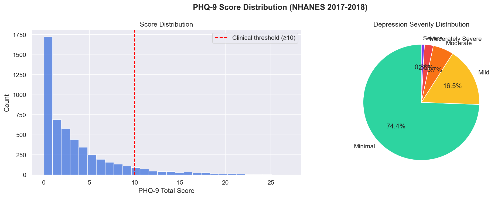
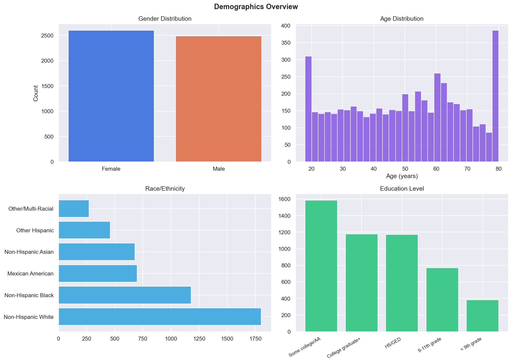
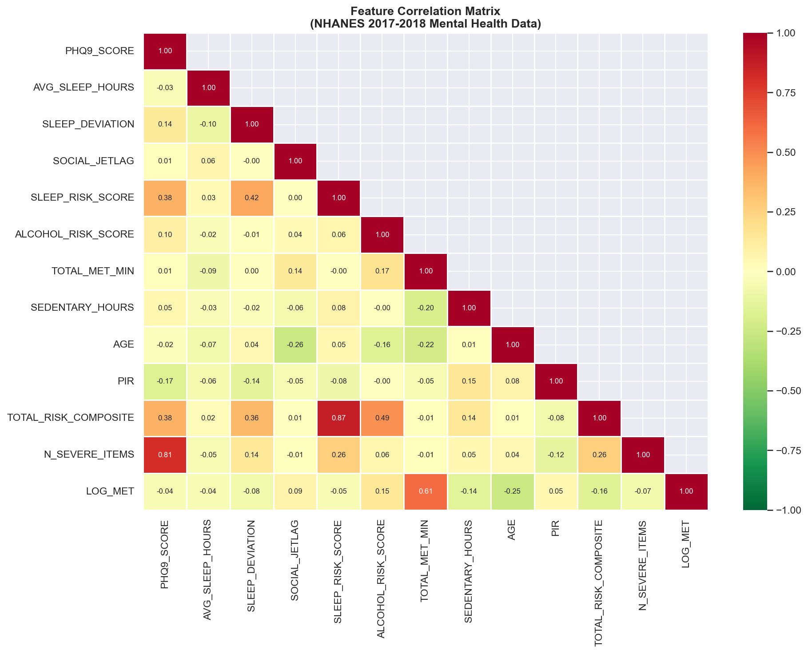
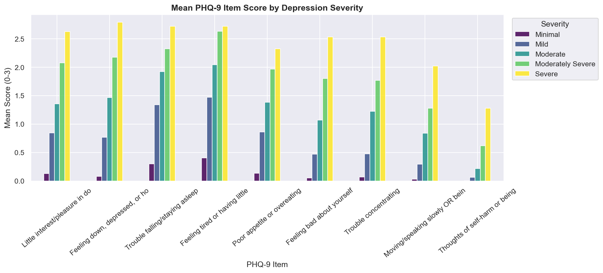
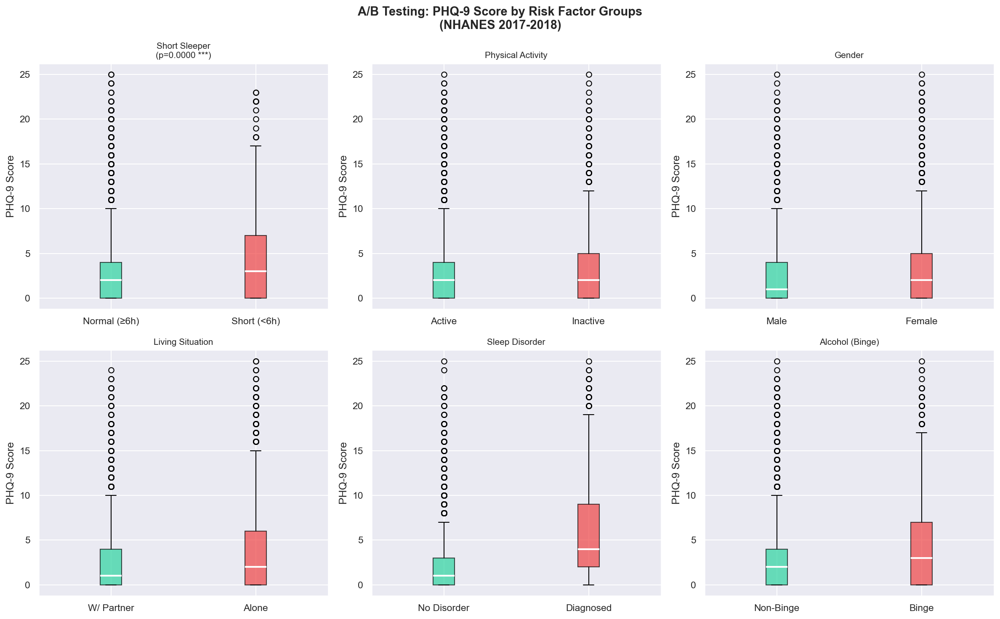
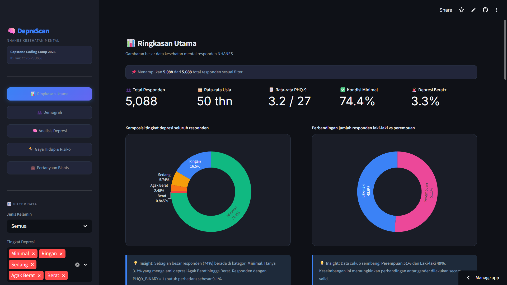

# DepreScan - Data Science Pipeline
### Sistem Deteksi Risiko Depresi Berdasarkan Gaya Hidup
**Coding Camp 2026 powered by DBS Foundation · Tim CC26-PSU066**

---

## Checklist Data Scientist Status

| Quest | Checklist |
|---|:---:|
| 1. Problem Discovery & Solution Definition | ✅ |
| 2. Measurable Business Questions | ✅ |
| 3. Data Wrangling (Gathering, Assessing, Cleaning) | ✅ |
| 4. Advanced Feature Engineering | ✅ |
| 5. Exploratory Data Analysis (EDA) | ✅ |
| 6. Statistical Hypothesis Testing (A/B Testing) | ✅ |
| 7. Dashboard Deployment | ✅ |
| 8. Comprehensive Technical Report | ✅ |


> Detail lengkap: lihat [CHECKLIST_STATUS.md](./CHECKLIST_STATUS.md)

---

## Daftar Isi
- [Gambaran Proyek](#gambaran-proyek)
- [Struktur Repositori](#struktur-repositori)
- [Dataset](#dataset)
- [Cara Menjalankan Pipeline](#cara-menjalankan-pipeline)
- [Workflow Teknis](#workflow-teknis)
  - [1. Gather](#1-gather---pengumpulan-data)
  - [2. Assess](#2-assess---audit-kualitas-data)
  - [3. Clean](#3-clean---pembersihan-data)
  - [4. Merge](#4-merge---penggabungan-dataset)
  - [5. Target Engineering](#5-target-engineering---variabel-target-phq-9)
  - [6. Feature Engineering](#6-feature-engineering---rekayasa-fitur)
  - [7. EDA](#7-eda---exploratory-data-analysis)
  - [8. A/B Testing](#8-ab-testing---uji-hipotesis)
  - [9. Save](#9-save---export-dataset-final)
- [Visualisasi Output](#visualisasi-output)
- [Dashboard Interaktif](#dashboard-interaktif)
- [Hasil Pipeline](#hasil-pipeline)
- [Referensi](#referensi)

---

## Gambaran Proyek

DepreScan hadir sebagai alat skrining mandiri berbasis web yang mendeteksi risiko depresi secara privat, objektif, dan terjangkau. Komponen Data Science bertugas membangun pipeline pemrosesan data end-to-end dari dataset NHANES 2017-2018 hingga menghasilkan dataset bersih yang siap digunakan oleh tim AI Engineer untuk melatih model Deep Learning.

**Mengapa NHANES 2017-2018?**
Siklus ini adalah siklus terakhir yang menggunakan format kuesioner PHQ-9 lengkap (`DPQ010–DPQ090`) sebelum NHANES mengubah metodologinya. Siklus 2019-2020 terdisrupsi pandemi COVID-19 dengan hanya ~4.000 responden, tidak representatif untuk kondisi populasi normal.

| Siklus | PHQ-9 Lengkap | N Sampel | Catatan |
|--------|---------------|----------|---------|
| 2013-2014 | Ya | 10.175 | Tersedia |
| 2015-2016 | Ya | 9.971 | Tersedia |
| **2017-2018** | **Ya** | **9.254** | **Terpilih, Pre-COVID** |
| 2019-2020 | Terbatas | ~4.000 | Terdisrupsi COVID |
| 2021-2023 | Format Berbeda | N/A | Metodologi berubah |

---

## Struktur Repositori

```
deprescan-data-science/
│  
├── README.md                            # Dokumen ini
├── requirements.txt
├── main.py                              # Entry point pipeline
│
├── data/
│   ├── raw/                         # File XPT mentah NHANES (tidak di-commit)
│   │   ├── DEMO_J.xpt
│   │   ├── DPQ_J.xpt
│   │   ├── ALQ_J.xpt
│   │   ├── PAQ_J.xpt
│   │   └── SLQ_J.xpt
│   ├── interim/                     # Dataset setelah cleaning (nhanes_mental_health_clean.csv)
│   └── processed/                   # Dataset siap model (nhanes_model_ready.csv)
│
├── src/
│   ├── config/
│   │   └── settings.py                 # Path, konstanta, mapping kode NHANES
│   ├── utils/
│   │   ├── sentinel.py                 # Decode SAS XPT sentinel-0
│   │   └── io.py                       # Load XPT, simpan CSV & PNG
│   ├── preproc/
│   │   ├── gather.py                   # Load semua file XPT
│   │   ├── assess.py                   # Audit kualitas data
│   │   ├── clean.py                    # Cleaning per modul
│   │   └── merge.py                    # Inner join via SEQN
│   ├── features/
│   │   ├── target.py                   # Bangun PHQ-9 score & label
│   │   ├── demographics.py             # Fitur demografi turunan
│   │   ├── alcohol.py                  # Fitur domain alkohol
│   │   ├── activity.py                 # Fitur domain aktivitas (MET)
│   │   ├── sleep.py                    # Fitur domain tidur
│   │   ├── feature_engineering.py      # Fitur interaksi & komposit
│   │   └── eda.py                      # EDA dan visualisasi
│   ├── experiments/
│   │   ├── ab_testing.py               # Uji hipotesis Mann-Whitney & Chi-square
│   │   └── README.md
│   └── pipeline/
│       └── run.py                      # Orkestrasi seluruh pipeline
│
└── outputs/
    ├── plot/                       # Plot EDA (7 PNG)
    ├── abtest/                     # Plot & CSV hasil A/B Testing
    └── json/                       # Metadata pipeline
```

> **Lihat detail tiap modul:**
> - [`src/config/`](./src/config/) · [`src/utils/`](./src/utils/) · [`src/preproc/`](./src/preproc/)
> - [`src/features/`](./src/features/) · [`src/experiments/`](./src/experiments/) · [`src/pipeline/`](./src/pipeline/)
> - [`outputs/plot/`](./outputs/plot/) · [`outputs/abtest/`](./outputs/abtest/) · [`outputs/json/`](./outputs/json/)
> - [`data/interim/`](./data/interim/) · [`data/processed/`](./data/processed/)

---

## Dataset

Lima file SAS XPT dari NHANES 2017-2018, unduh dari [CDC NHANES](https://wwwn.cdc.gov/nchs/nhanes/search/datapage.aspx?Component=Questionnaire&CycleBeginYear=2017) dan letakkan di `data/raw/`:

| File | Baris | Domain | Variabel Kunci |
|------|-------|--------|---------------|
| `DEMO_J.xpt` | 9.254 | Demografi | `RIAGENDR`, `RIDAGEYR`, `RIDRETH3`, `DMDEDUC2`, `INDFMPIR` |
| `DPQ_J.xpt` | 5.533 | PHQ-9 (Target) | `DPQ010`–`DPQ090`, `DPQ100` |
| `SLQ_J.xpt` | 6.161 | Tidur | `SLD012`, `SLD013`, `SLQ030`, `SLQ050`, `SLQ120` |
| `PAQ_J.xpt` | 5.856 | Aktivitas Fisik | `PAQ605`–`PAQ665`, `PAD615`–`PAD680` |
| `ALQ_J.xpt` | 5.533 | Alkohol | `ALQ111`, `ALQ121`, `ALQ130`, `ALQ151` |

> ⚠️ **Catatan teknis kritis:** Format SAS XPT meng-encode integer `0` sebagai nilai *floating-point* sentinel `5.397605346934028e-79`. Nilai ini harus di-decode sebelum analisis apapun (ditangani oleh `src/utils/sentinel.py`).

---

## Cara Menjalankan Pipeline

### 1. Clone repositori dan install dependensi

```powershell
git clone https://github.com/fbrianzy/DepreScan-Utils.git
cd DepreScan-Utils
```

### 2. Buat Virtual Environment agar tidak crash antar dependesi library utama dengan library project

```powershell
python -m venv deprescan

# Lalu aktifkan virtual env pada terminal
.\deprescan\Scripts\activate

# Setelah itu install semua dependesi yang diperlukan
pip install -r requirements.txt
```

### 3. Letakkan dataset di folder yang benar

```
data/raw/DEMO_J.xpt
data/raw/DPQ_J.xpt
data/raw/ALQ_J.xpt
data/raw/PAQ_J.xpt
data/raw/SLQ_J.xpt
```

Path ini sudah dikonfigurasi di [`src/config/settings.py`](./src/config/settings.py):

```python
RAW_DATA_DIR = "data/raw/"
OUTPUT_DIR   = "outputs"
O_DATASET    = ["data/interim", "data/processed"]
O_PLOT       = "outputs/plot"
O_JSON       = "outputs/json"
O_ABTEST     = "outputs/abtest"
```

### 4. Jalankan pipeline

```powershell
python main.py
```

Atau dari Pipeline utama:

```powershell
python -m src.pipeline.run
```

### 5. Skip EDA atau A/B Testing (opsional)

```python
run_full_pipeline(run_eda_flag=False, run_ab_flag=False)
```

---

## Workflow Teknis

Pipeline berjalan secara berurutan melalui 9 tahap yang diorkestrasikan oleh [`src/pipeline/run.py`](./src/pipeline/run.py):

```
┌───────────────────────────────────────────────────────────────┐
│  1. GATHER    → Load 5 file XPT dari data/raw/                │
│  2. ASSESS    → Audit kualitas: sentinel, missing, outlier    │
│  3. CLEAN     → Decode, imputasi, skip-logic per modul        │
│  4. MERGE     → Inner join via SEQN → 5.088 baris             │
│  5. TARGET    → PHQ9_SCORE, SEVERITY, LABEL, BINARY           │
│  6. FEATURES  → 73 fitur dari 4 domain gaya hidup             │
│  7. EDA       → 7 visualisasi PNG → outputs/plot/             │
│  8. A/B TEST  → 8 uji hipotesis → outputs/abtest/             │
│  9. SAVE      → data/interim/, data/processed/, outputs/json/ │
└───────────────────────────────────────────────────────────────┘
```

---

### 1. Gather - Pengumpulan Data
**Modul:** [`src/preproc/gather.py`](./src/preproc/gather.py)

Memuat kelima file XPT menggunakan `pandas.read_sas(format="xport")`. Tidak ada transformasi pada tahap ini; setiap DataFrame disimpan persis seperti yang dikembalikan dari file sumber untuk menjaga reproducibility audit data.

```python
from src.preproc.gather import gather_raw_data
raw_dfs = gather_raw_data()
# Output: dict {"DEMO_J": df, "ALQ_J": df, "DPQ_J": df, "PAQ_J": df, "SLQ_J": df}
```

---

### 2. Assess - Audit Kualitas Data
**Modul:** [`src/preproc/assess.py`](./src/preproc/assess.py)

Audit kualitas dilakukan per DataFrame dan menghasilkan laporan yang mencakup:
- Deteksi nilai **sentinel-0** (`5.397605e-79`) sebelum decode - membedakan "nol nyata" dari NaN
- **Missing values** setelah decode sentinel dan replace kode Refused/DK
- **Duplikat SEQN** (ID responden) yang bisa mengindikasikan error join
- **Outlier** menggunakan metode IQR pada kolom numerik kontinu
- **Nilai unik** per kolom sebagai sanity check

---

### 3. Clean - Pembersihan Data
**Modul:** [`src/preproc/clean.py`](./src/preproc/clean.py)

Cleaning dilakukan per modul dengan strategi yang disesuaikan karakteristik masing-masing:

| Modul | Tindakan Utama | Baris Setelah Clean |
|-------|----------------|-------------------|
| `DEMO_J` | Filter usia ≥18, decode sentinel RIDAGEYR & INDFMPIR, replace Refused (77/99) → NaN, imputasi EDUCATION (median) & MARITAL (mode) | 5.856 |
| `DPQ_J` | Decode sentinel 9 item PHQ-9, drop baris dengan semua item NaN (440 baris), drop >4 item NaN (5 baris), imputasi parsial dengan median | **5.088** |
| `SLQ_J` | Decode sentinel SLQ030/040/120, clipping SLD012/013 ke [2, 16] jam, imputasi NaN dengan median (8.0 jam) | 6.161 |
| `PAQ_J` | Replace 9999 (Don't Know) → NaN, skip-logic: PAQ=No → PAD=0, imputasi PAD680 (median 300 mnt) | 5.856 |
| `ALQ_J` | Decode sentinel ALQ121, skip-logic: ALQ111=2 (never drinker) → ALQ121=0 & ALQ130=0, replace 777/999 → NaN | 5.533 |

> `DPQ_J` adalah **bottleneck** pipeline karena PHQ-9 hanya diukur pada MEC-subsample.

---

### 4. Merge - Penggabungan Dataset
**Modul:** [`src/preproc/merge.py`](./src/preproc/merge.py)

Inner join kelima DataFrame menggunakan `SEQN` (Respondent Sequence Number) sebagai primary key. Urutan merge: `DPQ` (base) → `DEMO` → `ALQ` → `PAQ` → `SLQ`.

**Mengapa inner join?** Memastikan setiap responden memiliki data lengkap dari semua domain, menghasilkan dataset yang paling bersih untuk supervised learning meskipun mengurangi jumlah sampel dari 9.254 menjadi **5.088 baris**.

---

### 5. Target Engineering - Variabel Target PHQ-9
**Modul:** [`src/features/target.py`](./src/features/target.py)

Membangun empat variabel target dari 9 item `DPQ010–DPQ090`:

```
PHQ9_SCORE    = sum(DPQ010 + ... + DPQ090)        → range 0–27
PHQ9_SEVERITY = Minimal | Mild | Moderate |        → 5 kategori
                Moderately Severe | Severe
PHQ9_LABEL    = 0 | 1 | 2 | 3 | 4               → untuk multiclass
PHQ9_BINARY   = 1 jika PHQ9_SCORE ≥ 10           → threshold klinis
```

Threshold berdasarkan Kroenke, Spitzer & Williams (2001) - sensitivitas 88%, spesifisitas 88% pada PHQ-9 ≥ 10 untuk Major Depressive Disorder.

**Distribusi kelas (class imbalance):**

| Kategori | N | % |
|----------|---|---|
| Minimal (0–4) | 3.786 | **74,4%** |
| Mild (5–9) | 841 | 16,5% |
| Moderate (10–14) | 292 | 5,7% |
| Moderately Severe (15–19) | 126 | 2,5% |
| Severe (20–27) | 43 | 0,8% |

> ⚠️ Distribusi sangat tidak seimbang. Tim AI Engineer perlu menerapkan SMOTE atau `class_weight` sebelum training.

---

### 6. Feature Engineering - Rekayasa Fitur
**Modul:** [`src/features/demographics.py`](./src/features/demographics.py) · [`src/features/alcohol.py`](./src/features/alcohol.py) · [`src/features/activity.py`](./src/features/activity.py) · [`src/features/sleep.py`](./src/features/sleep.py) · [`src/features/feature_engineering.py`](./src/features/feature_engineering.py)

#### Domain Demografi
| Fitur | Formula/Logika |
|-------|---------------|
| `GENDER_F` | 1 jika perempuan (2), else 0 |
| `AGE_GROUP` | Bin usia: 18-29, 30-44, 45-59, 60-74, 75+ |
| `EDUCATION_ORD` | Ordinal 1–5 (cast integer dari EDUCATION) |
| `MARITAL_BINARY` | 1 jika Married atau Living with partner |
| `LIVING_ALONE` | 1 jika Widowed/Divorced/Separated/Never married |
| `PIR_GROUP` | Poor (<1) / Near poor (1-2) / Middle (2-4) / High (≥4) |
| `INCOME_BINARY` | 1 jika PIR < 1.5 |

#### Domain Tidur
| Fitur | Formula/Logika |
|-------|---------------|
| `AVG_SLEEP_HOURS` | (SLD012 + SLD013) / 2 |
| `SLEEP_DEVIATION` | \|AVG_SLEEP_HOURS − 8\| |
| `SOCIAL_JETLAG` | \|SLD013 − SLD012\| |
| `SHORT_SLEEPER` | 1 jika AVG_SLEEP_HOURS < 6 |
| `LONG_SLEEPER` | 1 jika AVG_SLEEP_HOURS > 9 |
| `SLEEP_DISORDERED` | 1 jika SLQ050 = 1 |
| `SLEEP_APNEA_RISK` | 1 jika SLQ040 ≥ 2 |
| `UNRESTED_FREQ` | SLQ120 ordinal 0–4 |
| `SLEEP_RISK_SCORE` | SHORT + LONG + DISORDERED + APNEA + (UNRESTED≥2) |

#### Domain Aktivitas Fisik (MET-minutes/week)
| Fitur | Formula/Logika |
|-------|---------------|
| `VIG_MIN_WEEK` | (PAD615 × 5) + (PAD660 × 3) |
| `MOD_MIN_WEEK` | (PAD630 × 5) + (PAD645 × 5) + (PAD675 × 3) |
| `TOTAL_MET_MIN` | VIG × 8.0 + MOD × 4.0 (koefisien WHO/GPAQ) |
| `LOG_MET` | log(1 + TOTAL_MET_MIN) |
| `SEDENTARY_HOURS` | PAD680 / 60 |
| `SEDENTARY_HIGH` | 1 jika SEDENTARY_HOURS > 8 |
| `MEETS_PA_GUIDELINE` | 1 jika TOTAL_MET_MIN ≥ 500 |
| `PHYSICALLY_INACTIVE` | 1 jika TOTAL_MET_MIN < 150 |
| `PA_CATEGORY` | Active / Insufficiently Active / Inactive |

#### Domain Alkohol
| Fitur | Formula/Logika |
|-------|---------------|
| `ALCOHOL_EVER` | 1 jika ALQ111 = 1 |
| `ALCOHOL_CURRENT` | 1 jika ALQ121 > 0 |
| `DRINK_FREQ_SCORE` | Invert ALQ121: 0→0, 1→10, 10→1 |
| `AVG_DRINKS_DAY` | = ALQ130 |
| `BINGE_DRINKER` | 1 jika ALQ151 = 1 |
| `HEAVY_DRINKER` | 1 jika AVG_DRINKS_DAY > 4 (NIAAA threshold) |
| `ALCOHOL_RISK_SCORE` | CURRENT + BINGE + HEAVY (0–3) |

#### Fitur Interaksi & Komposit
| Fitur | Formula | Tujuan |
|-------|---------|--------|
| `SLEEP_X_INACTIVE` | SHORT_SLEEPER × PHYSICALLY_INACTIVE | Efek sinergis kurang tidur + inaktivitas |
| `ALCOHOL_X_SEDENTARY` | ALCOHOL_RISK_SCORE × SEDENTARY_HIGH | Kombinasi perilaku berisiko |
| `LONELINESS_PROXY` | LIVING_ALONE × (UNRESTED_FREQ ≥ 2) | Proxy kesepian multi-dimensi |
| `SLEEP_ALCOHOL_SUM` | SLEEP_RISK_SCORE + ALCOHOL_RISK_SCORE | Beban dua faktor mayor |
| `ACTIVE_FEMALE_YOUNG` | GENDER_F × PHYSICALLY_INACTIVE × (AGE ≤ 44) | Kelompok rentan spesifik |
| `AGE_SLEEP_INTERACT` | AGE × SLEEP_DEVIATION | Efek kumulatif penuaan + gangguan tidur |
| `PIR_INACTIVE` | (PIR < 1.5) × PHYSICALLY_INACTIVE | Kemiskinan + inaktivitas |
| `TOTAL_RISK_COMPOSITE` | 2×SLEEP + 1.5×ALC + 1×INACTIVE + 0.5×SED | Domain-weighted risk score |

---

### 7. EDA - Exploratory Data Analysis
**Modul:** [`src/features/eda.py`](./src/features/eda.py) → Output: [`outputs/plot/`](./outputs/plot/)

Menghasilkan 7 visualisasi yang disimpan sebagai PNG:

---

### 8. A/B Testing - Uji Hipotesis
**Modul:** [`src/experiments/ab_testing.py`](./src/experiments/ab_testing.py) → Output: [`outputs/abtest/`](./outputs/abtest/)

Delapan uji hipotesis menggunakan Mann-Whitney U (non-parametrik, karena PHQ-9 tidak normal) dan Chi-square (untuk proporsi):

| Uji | Metode | p-value | Effect Size | Keputusan |
|-----|--------|---------|-------------|-----------|
| Short vs Normal Sleeper | Mann-Whitney U | < 0.001 | r = 0.159 (Small) | REJECT H₀ |
| Inactive vs Active | Mann-Whitney U | < 0.001 | r = 0.066 (Negligible) | REJECT H₀ |
| Male vs Female | Mann-Whitney U | < 0.001 | r = 0.156 (Small) | REJECT H₀ |
| With Partner vs Alone | Mann-Whitney U | < 0.001 | r = 0.162 (Small) | REJECT H₀ |
| **No Disorder vs Sleep Disordered** | Mann-Whitney U | **< 0.001** | **r = 0.442 (Medium)** | **REJECT H₀** |
| High vs Low Income (PIR) | Chi-square | < 0.001 | V = 0.090 (Negligible) | REJECT H₀ |
| Non-binge vs Binge Drinker | Mann-Whitney U | < 0.001 | r = 0.208 (Small) | REJECT H₀ |
| Low vs High Sedentary | Mann-Whitney U | 0.005 | r = 0.059 (Negligible) | REJECT H₀ |

> **Temuan utama:** Gangguan tidur yang didiagnosis (`SLEEP_DISORDERED`) adalah faktor risiko tunggal dengan effect size terbesar (Medium, r = 0.442).

---

### 9. Save - Export Dataset Final
**Modul:** [`src/pipeline/run.py`](./src/pipeline/run.py)

| File Output | Path | Keterangan |
|-------------|------|-----------|
| `nhanes_mental_health_clean.csv` | [`data/interim/`](./data/interim/) | Dataset lengkap 5.088 × 96 kolom |
| `nhanes_model_ready.csv` | [`data/processed/`](./data/processed/) | Siap model: 5.088 × 73 fitur + 4 target |
| `pipeline_metadata.json` | [`outputs/json/`](./outputs/json/) | Ringkasan kolom, distribusi kelas, binary rate |

---

## Visualisasi Output

### Distribusi PHQ-9
> Histogram skor dan pie chart distribusi 5 kategori severity. Garis merah = ambang klinis (≥ 10).



---

### Demografi Sampel
> Distribusi gender, usia (18–80), ras/etnis 6 kategori, dan tingkat pendidikan.



---

### Tidur vs Tingkat Depresi
> Rata-rata jam tidur, social jetlag, dan persentase short sleeper per kategori severity.


---

### Aktivitas Fisik vs Tingkat Depresi
> Log(MET-minutes/week) per severity dan persentase inaktif per kategori.


---

### Heatmap Korelasi
> Korelasi Pearson antar 13 variabel kunci dengan PHQ9_SCORE. `N_SEVERE_ITEMS` (r=0.81) dan `SLEEP_RISK_SCORE` (r=0.38) adalah prediktor terkuat.



---

### Profil Item PHQ-9 per Severity
> Rata-rata skor 9 item PHQ-9 (0–3) per kategori. Item fatigue (DPQ040) dan gangguan tidur (DPQ030) adalah gejala yang muncul lebih awal.



---

### Prevalensi Faktor Risiko
> Perbandingan prevalensi 8 faktor risiko antara kelompok non-klinis (PHQ-9 < 10) dan klinis signifikan (PHQ-9 ≥ 10). `SLEEP_DISORDERED` menunjukkan selisih terbesar (62,5% vs 24,4%).


---

### A/B Testing - Boxplot Perbandingan
> Distribusi PHQ-9 score antar kelompok untuk 6 dari 8 uji hipotesis yang dilakukan.



> Hasil lengkap A/B Testing tersimpan di [`outputs/abtest/ab_test_results.csv`](./outputs/abtest/ab_test_results.csv)

---

## Dashboard Interaktif

Dashboard Streamlit dibangun dalam **repositori terpisah** oleh tim Data Scientist. Dashboard menampilkan seluruh analisis secara interaktif dengan 5 halaman: **Overview, Demografi, Depresi, Gaya Hidup** dan **Pertanyaan Bisnis**.

> 🔗 **Repository Dashboard:** [Utils DepreScan-Dashboad](https://github.com/DepreScanAI/DataScientist/tree/main/Dashboard)
>
> 🌐 **Live Demo (Streamlit Cloud):** [Deprescan-Dashboard](https://deprescan-dashboard.streamlit.app/)

Tampilan utama Dashboard DepreScan

<a href="https://deprescan-dashboard.streamlit.app/">
  
</a>
**Cara menjalankan dashboard secara lokal:**  

1. Clone Repository lalu masuk ke dalam folder Dashboard
```powershell
git clone https://github.com/DepreScanAI/DataScientist.git
cd DataScientist
cd Dashboard
```

2. Buat Virtual Environment untuk Dashboard
```powershell
python -m venv depscan-dash
./depscan-dash/Scripts/activate
```

3. Install Dependencies yang diperlukan lalu jalankan
```powershell
pip install -r requirements.txt
streamlit run dashboard_nhanes_Final.py
```

---

## Hasil Pipeline

```
╔══════════════════════════════════════════════════════════╗
║  PIPELINE COMPLETE                                       ║
╠══════════════════════════════════════════════════════════╣
║  Final dataset  : 5.088 rows × 96 columns                ║
║  PHQ-9 Positive : 461 (9.1%)                             ║
║  Model features : 73                                     ║
║  Output dirs    : data/ · outputs/plot · json · abtest   ║
╚══════════════════════════════════════════════════════════╝
```

**Dataset final (`data/processed/nhanes_model_ready.csv`):**
- **5.088** responden dewasa (usia ≥ 18)
- **73 fitur** dari 4 domain gaya hidup
- **4 target variable:** `PHQ9_SCORE`, `PHQ9_SEVERITY`, `PHQ9_LABEL`, `PHQ9_BINARY`
- **Binary positive rate:** 9,06% (PHQ-9 ≥ 10)

---

## Referensi

1. Kroenke, K., Spitzer, R. L., & Williams, J. B. W. (2001). [The PHQ-9: Validity of a brief depression severity measure. *Journal of General Internal Medicine, 16*(9), 606–613.](https://pmc.ncbi.nlm.nih.gov/articles/PMC1495268/)
2. National Center for Health Statistics. (2020). *National Health and Nutrition Examination Survey Data 2017–2018*. CDC/NCHS. https://wwwn.cdc.gov/nchs/nhanes/
3. Cappuccio, F. P., et al. (2010). [Sleep duration predicts cardiovascular outcomes. *European Heart Journal, 32*(12), 1484–1492.](https://pubmed.ncbi.nlm.nih.gov/21300732/)

---

<div align="center">

**DepreScan · CC26-PSU066 · Coding Camp 2026 powered by DBS Foundation**

</div>
